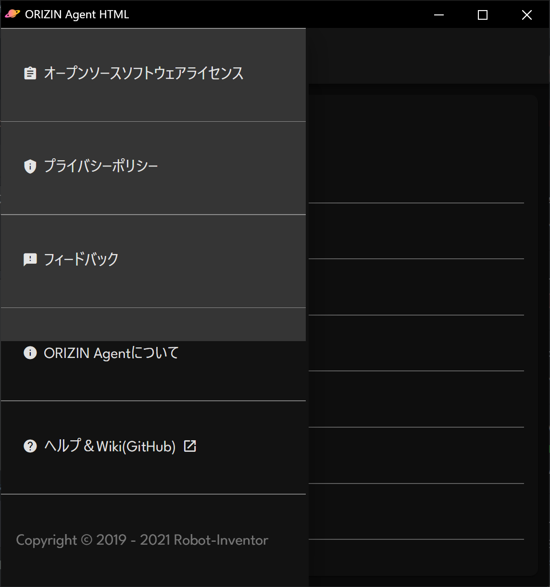
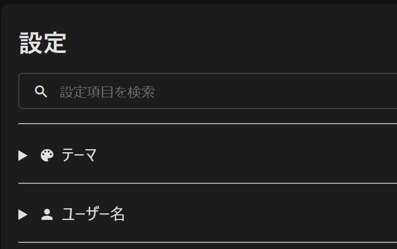

# Change Log

このプロジェクトに対するすべての重要な変更は、このファイルに文書化されます。

## 情報

Series Name: ORIZIN Agent  
Edition: ORIZIN Agent HTML

他の情報を読むには、resource/information.jsonを参照してください。

## バージョニング

"a.b.c.de-f"というバージョン番号の意味は次のとおりです。

|位置|意味|文字の種類|最小値|
|:--:|:--:|:--:|:--:|
|a|メジャーバージョン|数字|0|
|b|マイナーバージョン|数字|0|
|c|ビルド（累積バージョン）|数字|1|
|d|リビジョン|数字|0|
|e|リリース|アルファベット（devまたはなし）|N/A|
|f|開発コードネーム|アルファベット|N/A|

それぞれの言葉の意味は次のとおりです。

|言葉|意味|
|:--:|:--:|
|メジャーバージョン|大きな機能の追加またはUIの大きな変更|
|マイナーバージョン|小さな機能の追加またはUIの小さな変更|
|ビルド（累積バージョン）|バージョン番号が変わるたびにこの数字が増えます|
|リビジョン|バグの修正またはプログラム中のコメントの変更|
|リリース|プログラムがDevelop版の場合"dev"になる|
|開発コードネーム|メジャー（マイナー）バージョンのコードネーム|

## リリース

### [v5.2.148.0dev-Eagle] - 2021-05-12

#### 追加

- ショートカットキーの一覧にスペースキーを追加しました　[#122](https://github.com/Robot-Inventor/ORIZIN-Agent-HTML/issues/122)
- 検索ボックスのXにリップルエフェクトを追加しました　[#113](https://github.com/Robot-Inventor/ORIZIN-Agent-HTML/issues/113)
- 設定と試験機能ページの下部にパディングを追加しました　[#151](https://github.com/Robot-Inventor/ORIZIN-Agent-HTML/issues/151)

#### 変更

- 設定ページのアップデートのダウンロードボタンをMaterial Web Componentに変更しました　[#136](https://github.com/Robot-Inventor/ORIZIN-Agent-HTML/issues/136)
- 設定ページのアップデートのダウンロードボタンのリンク先を個別のリリースページに変更しました　[#137](https://github.com/Robot-Inventor/ORIZIN-Agent-HTML/issues/137)
- バージョン情報をコピーしたときにボタンのアイコンが変更されるようになりました　[#146](https://github.com/Robot-Inventor/ORIZIN-Agent-HTML/issues/146)
- 設定の検索ボックスが未入力のときに入力可能領域を右端まで伸ばすことで使いやすくしました　[#142](https://github.com/Robot-Inventor/ORIZIN-Agent-HTML/issues/142)
- メニューの開閉ボタンをmwc-icon-buttonに置き換えました　[#145](https://github.com/Robot-Inventor/ORIZIN-Agent-HTML/issues/145)
- すべてのアイコンをmwc-iconに置き換えました　[#158](https://github.com/Robot-Inventor/ORIZIN-Agent-HTML/issues/158)
- すべてのアイコンボタンをmwc-icon-buttonに置き換えました　[#159](https://github.com/Robot-Inventor/ORIZIN-Agent-HTML/issues/159)
- search-boxコンポーネントにグリッドレイアウトを採用しました　[#180](https://github.com/Robot-Inventor/ORIZIN-Agent-HTML/issues/180)
- search-boxのデザインを改善しました　[#190](https://github.com/Robot-Inventor/ORIZIN-Agent-HTML/issues/190)
- experiment-cardコンポーネントにグリッドレイアウトを採用しました　[#181](https://github.com/Robot-Inventor/ORIZIN-Agent-HTML/issues/181)

### [v5.1.147.2-Eagle] - 2021-05-11

#### 追加

- 設定の検索時に検索対象・検索キーワードの両方に対し、半角・全角の正規化とひらがな・カタカナの正規化を行う機能を追加しました　[#120](https://github.com/Robot-Inventor/ORIZIN-Agent-HTML/issues/120)
- 次の試験機能を追加しました
  - ヒントの設定を表示する　[#53](https://github.com/Robot-Inventor/ORIZIN-Agent-HTML/issues/53)
  - 読み取り専用モードのサポートの有効化　[#173](https://github.com/Robot-Inventor/ORIZIN-Agent-HTML/issues/173)
- フィードバックにシステム情報を含めるオプションを追加しました　[#116](https://github.com/Robot-Inventor/ORIZIN-Agent-HTML/issues/116)
- 設定の検索にタグ機能を追加しました　[#99](https://github.com/Robot-Inventor/ORIZIN-Agent-HTML/issues/99)
- stylelintを導入しました　[#171](https://github.com/Robot-Inventor/ORIZIN-Agent-HTML/issues/171)

#### 変更

- 試験機能ページの各項目をコンポーネント化しました　[#101](https://github.com/Robot-Inventor/ORIZIN-Agent-HTML/issues/101)
- コンポーネント関連のJavaScriptを別ファイルに分けました　[#105](https://github.com/Robot-Inventor/ORIZIN-Agent-HTML/issues/105)
- フィードバックの送信時にシステムの情報を送信するオプションが追加されたため、プライバシーポリシーを改定しました　[#116](https://github.com/Robot-Inventor/ORIZIN-Agent-HTML/issues/116)
- information.txtはinformation.jsonに変わりました　[#133](https://github.com/Robot-Inventor/ORIZIN-Agent-HTML/issues/133)
- 設定ファイルをjson形式に移行しました　[#162](https://github.com/Robot-Inventor/ORIZIN-Agent-HTML/issues/162)

#### 削除

- 「改善されたカスタムテーマの編集ページを使用する」試験機能を削除しました　[#98](https://github.com/Robot-Inventor/ORIZIN-Agent-HTML/issues/98)

#### 修正

- 試験機能ページで続行確認後にメッセージが切り替わらないバグを修正しました　[#100](https://github.com/Robot-Inventor/ORIZIN-Agent-HTML/issues/100)
- 検索機能が動作しないバグを修正しました　[#110](https://github.com/Robot-Inventor/ORIZIN-Agent-HTML/issues/110)
- 初期設定画面でメニューを開くと背景をクリックしてもメニューが閉じないバグを修正しました　[#94](https://github.com/Robot-Inventor/ORIZIN-Agent-HTML/issues/94)
- 「オープンソースソフトウェアライセンス」ページのデータをjson化しました　[#124](https://github.com/Robot-Inventor/ORIZIN-Agent-HTML/issues/124)
- オープンソースソフトウェアライセンスに[Material Web Components](https://github.com/material-components/material-components-web-components)が抜けていたため修正しました　[#128](https://github.com/Robot-Inventor/ORIZIN-Agent-HTML/issues/128)
- 試験機能ページの検索対象に試験機能のタイトルが含まれていなかったため修正しました　[#131](https://github.com/Robot-Inventor/ORIZIN-Agent-HTML/issues/131)
- デバッグ用に使ったまま残っているconsole.log()を削除しました　[#144](https://github.com/Robot-Inventor/ORIZIN-Agent-HTML/issues/144)
- flag.js内の試験機能一覧をjson化しました　[#174](https://github.com/Robot-Inventor/ORIZIN-Agent-HTML/issues/174)
- アップデートの確認時にリリースチャンネルが無視されるバグを修正しました　[#178](https://github.com/Robot-Inventor/ORIZIN-Agent-HTML/issues/178)

#### Notice

- このバージョンは、v5.0.144.11dev-Eagleからv5.1.146.1dev-Eagleまでのアップデートの正式版です
- このバージョンでは設定ファイルのファイル形式が変更されており、後方互換性はありません。アップデートではなく再ダウンロードを推奨します

### [v5.1.146.1dev-Eagle] - 2021-05-11

#### 修正

- アップデートの確認時にリリースチャンネルが無視されるバグを修正しました　[#178](https://github.com/Robot-Inventor/ORIZIN-Agent-HTML/issues/178)

### [v5.1.145.0dev-Eagle] - 2021-05-10

#### 追加

- 設定の検索時に検索対象・検索キーワードの両方に対し、半角・全角の正規化とひらがな・カタカナの正規化を行う機能を追加しました　[#120](https://github.com/Robot-Inventor/ORIZIN-Agent-HTML/issues/120)
- 次の試験機能を追加しました
  - ヒントの設定を表示する　[#53](https://github.com/Robot-Inventor/ORIZIN-Agent-HTML/issues/53)
  - 読み取り専用モードのサポートの有効化　[#173](https://github.com/Robot-Inventor/ORIZIN-Agent-HTML/issues/173)
- フィードバックにシステム情報を含めるオプションを追加しました　[#116](https://github.com/Robot-Inventor/ORIZIN-Agent-HTML/issues/116)
- 設定の検索にタグ機能を追加しました　[#99](https://github.com/Robot-Inventor/ORIZIN-Agent-HTML/issues/99)
- stylelintを導入しました　[#171](https://github.com/Robot-Inventor/ORIZIN-Agent-HTML/issues/171)

#### 変更

- フィードバックの送信時にシステムの情報を送信するオプションが追加されたため、プライバシーポリシーを改定しました　[#116](https://github.com/Robot-Inventor/ORIZIN-Agent-HTML/issues/116)
- information.txtはinformation.jsonに変わりました　[#133](https://github.com/Robot-Inventor/ORIZIN-Agent-HTML/issues/133)
- 設定ファイルをjson形式に移行しました　[#162](https://github.com/Robot-Inventor/ORIZIN-Agent-HTML/issues/162)

#### 修正

- 「オープンソースソフトウェアライセンス」ページのデータをjson化しました　[#124](https://github.com/Robot-Inventor/ORIZIN-Agent-HTML/issues/124)
- オープンソースソフトウェアライセンスに[Material Web Components](https://github.com/material-components/material-components-web-components)が抜けていたため修正しました　[#128](https://github.com/Robot-Inventor/ORIZIN-Agent-HTML/issues/128)
- 試験機能ページの検索対象に試験機能のタイトルが含まれていなかったため修正しました　[#131](https://github.com/Robot-Inventor/ORIZIN-Agent-HTML/issues/131)
- デバッグ用に使ったまま残っているconsole.log()を削除しました　[#144](https://github.com/Robot-Inventor/ORIZIN-Agent-HTML/issues/144)
- flag.js内の試験機能一覧をjson化しました　[#174](https://github.com/Robot-Inventor/ORIZIN-Agent-HTML/issues/174)

### [v5.0.144.11dev-Eagle] - 2021-05-03

#### 変更

- 試験機能ページの各項目をコンポーネント化しました　[#101](https://github.com/Robot-Inventor/ORIZIN-Agent-HTML/issues/101)
- コンポーネント関連のJavaScriptを別ファイルに分けました　[#105](https://github.com/Robot-Inventor/ORIZIN-Agent-HTML/issues/105)

#### 削除

- 「改善されたカスタムテーマの編集ページを使用する」試験機能を削除しました　[#98](https://github.com/Robot-Inventor/ORIZIN-Agent-HTML/issues/98)

#### 修正

- 試験機能ページで続行確認後にメッセージが切り替わらないバグを修正しました　[#100](https://github.com/Robot-Inventor/ORIZIN-Agent-HTML/issues/100)
- 検索機能が動作しないバグを修正しました　[#110](https://github.com/Robot-Inventor/ORIZIN-Agent-HTML/issues/110)
- 初期設定画面でメニューを開くと背景をクリックしてもメニューが閉じないバグを修正しました　[#94](https://github.com/Robot-Inventor/ORIZIN-Agent-HTML/issues/94)

### [v5.0.143.10-Eagle] - 2021-03-08

#### 変更

- HTMLファイルに直書きとなっていたCSSとJavaScriptを別ファイルに切り出しました　[#93](https://github.com/Robot-Inventor/ORIZIN-Agent-HTML/issues/93)

#### セキュリティー

- プロトタイプ汚染脆弱性を修正しました　[#96](https://github.com/Robot-Inventor/ORIZIN-Agent-HTML/issues/96)

#### Notice

- このバージョンは、脆弱性修正の緊急アップデートv5.0.142.9dev-Eagleの正式版です

### [v5.0.142.9dev-Eagle] - 2021-03-08

#### 変更

- HTMLファイルに直書きとなっていたCSSとJavaScriptを別ファイルに切り出しました　[#93](https://github.com/Robot-Inventor/ORIZIN-Agent-HTML/issues/93)

#### セキュリティー

- プロトタイプ汚染脆弱性を修正しました　[#96](https://github.com/Robot-Inventor/ORIZIN-Agent-HTML/issues/96)

#### 修正

- リファクタリングを行いました

### [v5.0.141.8-Eagle] - 2021-03-07

#### 追加

- オープンソースソフトウェアライセンスページにOSSのリポジトリーを開くボタンを追加しました
- ORIZIN Agentについてページにバージョンなどの情報をコピーするボタンを追加しました
- node_modulesのライセンス管理システムを追加しました
- SCSSを導入しました
- 「カスタムテーマの編集」ページでカスタマイズできる項目に「ヘッダーの背景色」を追加しました
- 「カスタムテーマの編集」ページでカスタマイズできる項目に「エラーの文字色」を追加しました
- ESLintを導入しました
- 設定ページに初期化を追加しました
- ホームのテキストボックスと、設定の検索ボックス、試験機能の検索ボックスに次のショートカットキーを追加しました　[#36](https://github.com/Robot-Inventor/ORIZIN-Agent-HTML/issues/36)
  - ``/``で検索ボックスにフォーカス
  - ``S``で検索ボックスにフォーカス
  - ``Esc``で検索ボックスからフォーカスを外す
  - ``Ctrl + Backspace``で検索ボックスをクリア
- 次のグローバルなショートカットキーを追加しました　[#44](https://github.com/Robot-Inventor/ORIZIN-Agent-HTML/issues/44)
  - ``Ctrl + ,``で設定を開く
  - ``H``、``T``または``Home``でホームに戻る
  - ``M``でメニューを開く
- 設定ページにショートカットキーの一覧を追加しました　[#47](https://github.com/Robot-Inventor/ORIZIN-Agent-HTML/issues/47)

#### 変更

- ライセンスとメニュー下部の西暦を「2019 - 2020」から「2019 - 2021」に変更しました
- メニューのUXを改善しました
- 全体的なデザインを改善しました
- UIの一部をMaterial Web Componentsに置き換えました
- ダークモード時の背景色をマテリアルデザインに基づいて改善しました
- ライトテーマ時の背景色をマテリアルデザインに基づいて改善しました
- 影やマウスホバー時の色などをマテリアルデザインに基づいて改善しました
- トップページのデザインをマテリアルデザインに基づいて改善しました
- ページ読み込み時のレイアウトシフトを軽減しました
- ダークモード時のヘッダーの色をダークグレーに変更しました
- ダークモード時の文字色をマテリアルデザインに基づいて改善しました
- ライトテーマ時の文字色をマテリアルデザインに基づいて改善しました
- エラーの文字色をマテリアルデザインに基づいて改善しました
- 一部のUIをカスタム要素を用いてコンポーネント化しました
- v5.0になったため、コードネームをDuckからEagleに変更しました
- webpackのMinify化を有効にしました
- UIの一部をMaterial Web Componentsに置き換えました
- プライバシーポリシーを変更しました
- 次の機能を正式な機能に移行しました
  - 設定の検索
  - アップデートチェッカー
- 設定の検索ボックスのデザインを改善しました　[#38](https://github.com/Robot-Inventor/ORIZIN-Agent-HTML/issues/38)
- フィードバックページのデザインを改善しました　[#37](https://github.com/Robot-Inventor/ORIZIN-Agent-HTML/issues/37)
- スクロールバーのデザインと挙動を改善しました　[#39](https://github.com/Robot-Inventor/ORIZIN-Agent-HTML/issues/39)
- details要素のホバー時のオーバーレイの不透明度を下げ、色を改善しました　[#74](https://github.com/Robot-Inventor/ORIZIN-Agent-HTML/issues/74)
- League Spartan VariableのバージョンをVersion 2.201から最新のVersion 2.220にアップデートしました
- Pickrをv1.7.4から最新のv1.8.0にアップデートしました

#### 修正

- リファクタリングを行いました
- オープンソースソフトウェアライセンスページのOSSをアルファベット順になっていない箇所があったため修正しました
- テーマの設定を変更した状態で``git pull``を実行するとコンフリクトが発生する問題を修正しました
- v5.0.133.0dev-Eagleのコミット525b04ac89ee9bae2b1d6444d26ea36b0df8afe4における「テーマの設定を変更した状態で``git pull``を実行するとコンフリクトが発生する問題」の修正が不完全だったため対応しました
- UIの一部の色を修正しました
- テーマのデフォルトの設定のが間違っていたため修正しました
- `npm install`を実行すると起動にかかる時間が長くなる問題を修正しました
- チャットの入力欄がオーバーフローにより上下にスクロールできるバグを修正しました　[#60](https://github.com/Robot-Inventor/ORIZIN-Agent-HTML/issues/60)
- v5.0.133.0dev-Eagleのコミットe79bf9b0b9a4c701e1cb67050841ed1254bdf041における、resource/css/layout.scssの変更によって生じた、音声認識中にマイクアイコンの色が変わらないバグを修正しました　[#61](https://github.com/Robot-Inventor/ORIZIN-Agent-HTML/issues/61)
- メニューにスクロールが発生すると、白の半透明のオーバーレイの高さがスクロールを考慮していないために色が不自然になるバグを修正しました　[#63](https://github.com/Robot-Inventor/ORIZIN-Agent-HTML/issues/63)

- Chromeの仕様変更によって発生した、details要素に三角形が出てしまうバグを修正しました　[#72](https://github.com/Robot-Inventor/ORIZIN-Agent-HTML/issues/72)

- カスタムテーマを保存できないバグを修正しました　[#78](https://github.com/Robot-Inventor/ORIZIN-Agent-HTML/issues/78)
- フィードバックで送信ボタンを連打すると重複して送信される可能性がある問題を修正しました　[#57](https://github.com/Robot-Inventor/ORIZIN-Agent-HTML/issues/57)
- changelog.md内で、リリース日の2021となるべきところが2020のままになっている箇所があったため修正しました　[#84](https://github.com/Robot-Inventor/ORIZIN-Agent-HTML/issues/84)
- UIなどの読点を「、」に統一しました　[#62](https://github.com/Robot-Inventor/ORIZIN-Agent-HTML/issues/62)
- UIやプライバシーポリシーなど、全体的に文章を改善しました　[#87](https://github.com/Robot-Inventor/ORIZIN-Agent-HTML/issues/87)
- 連続音声認識の設定の文章が「音声合成の終了後、自動で音声認識を再開する」とするべきところが「音声認識の終了後、自動で音声認識を再開する」となっていたため修正しました　[#89](https://github.com/Robot-Inventor/ORIZIN-Agent-HTML/issues/89)
- 初期設定画面で表示されるライセンスとプライバシーポリシーを最新の内容に更新しました　[#86](https://github.com/Robot-Inventor/ORIZIN-Agent-HTML/issues/86)

#### 削除

- jQueryを削除しました
- 不要になったbasic.htmlを削除しました　[#80](https://github.com/Robot-Inventor/ORIZIN-Agent-HTML/issues/80)

#### Notice

- このバージョンは、v5.0.133.0dev-Eagleからv5.0.140.7dev-Eagleまでのアップデートの正式版です

### [v5.0.140.7dev-Eagle] - 2021-03-07

#### 修正

- フィードバックで送信ボタンを連打すると重複して送信される可能性がある問題を修正しました　[#57](https://github.com/Robot-Inventor/ORIZIN-Agent-HTML/issues/57)
- changelog.md内で、リリース日の2021となるべきところが2020のままになっている箇所があったため修正しました　[#84](https://github.com/Robot-Inventor/ORIZIN-Agent-HTML/issues/84)
- UIなどの読点を「、」に統一しました　[#62](https://github.com/Robot-Inventor/ORIZIN-Agent-HTML/issues/62)
- UIやプライバシーポリシーなど、全体的に文章を改善しました　[#87](https://github.com/Robot-Inventor/ORIZIN-Agent-HTML/issues/87)
- 連続音声認識の設定の文章が「音声合成の終了後、自動で音声認識を再開する」とするべきところが「音声認識の終了後、自動で音声認識を再開する」となっていたため修正しました　[#89](https://github.com/Robot-Inventor/ORIZIN-Agent-HTML/issues/89)
- 初期設定画面で表示されるライセンスとプライバシーポリシーを最新の内容に更新しました　[#86](https://github.com/Robot-Inventor/ORIZIN-Agent-HTML/issues/86)

### [v5.0.139.6dev-Eagle] - 2021-03-06

#### 変更

- フィードバックページのデザインを改善しました　[#37](https://github.com/Robot-Inventor/ORIZIN-Agent-HTML/issues/37)
- スクロールバーのデザインと挙動を改善しました　[#39](https://github.com/Robot-Inventor/ORIZIN-Agent-HTML/issues/39)
- details要素のホバー時のオーバーレイの不透明度を下げ、色を改善しました　[#74](https://github.com/Robot-Inventor/ORIZIN-Agent-HTML/issues/74)
- League Spartan VariableのバージョンをVersion 2.201から最新のVersion 2.220にアップデートしました
- Pickrをv1.7.4から最新のv1.8.0にアップデートしました

#### 修正

- リファクタリングを行いました
- チャットの入力欄がオーバーフローにより上下にスクロールできるバグを修正しました　[#60](https://github.com/Robot-Inventor/ORIZIN-Agent-HTML/issues/60)
- v5.0.133.0dev-Eagleのコミットe79bf9b0b9a4c701e1cb67050841ed1254bdf041における、resource/css/layout.scssの変更によって生じた、音声認識中にマイクアイコンの色が変わらないバグを修正しました　[#61](https://github.com/Robot-Inventor/ORIZIN-Agent-HTML/issues/61)
- メニューにスクロールが発生すると、白の半透明のオーバーレイの高さがスクロールを考慮していないために色が不自然になるバグを修正しました　[#63](https://github.com/Robot-Inventor/ORIZIN-Agent-HTML/issues/63)

- Chromeの仕様変更によって発生した、details要素に三角形が出てしまうバグを修正しました　[#72](https://github.com/Robot-Inventor/ORIZIN-Agent-HTML/issues/72)

- カスタムテーマを保存できないバグを修正しました　[#78](https://github.com/Robot-Inventor/ORIZIN-Agent-HTML/issues/78)

#### 削除

- 不要になったbasic.htmlを削除しました　[#80](https://github.com/Robot-Inventor/ORIZIN-Agent-HTML/issues/80)

### [v5.0.138.5dev-Eagle] - 2021-02-10

#### 追加

- ホームのテキストボックスと、設定の検索ボックス、試験機能の検索ボックスに次のショートカットキーを追加しました　[#36](https://github.com/Robot-Inventor/ORIZIN-Agent-HTML/issues/36)
  - ``/``で検索ボックスにフォーカス
  - ``S``で検索ボックスにフォーカス
  - ``Esc``で検索ボックスからフォーカスを外す
  - ``Ctrl + Backspace``で検索ボックスをクリア
- 次のグローバルなショートカットキーを追加しました　[#44](https://github.com/Robot-Inventor/ORIZIN-Agent-HTML/issues/44)
  - ``Ctrl + ,``で設定を開く
  - ``H``、``T``または``Home``でホームに戻る
  - ``M``でメニューを開く
- 設定ページにショートカットキーの一覧を追加しました　[#47](https://github.com/Robot-Inventor/ORIZIN-Agent-HTML/issues/47)

#### 変更

- 設定の検索ボックスのデザインを改善しました　[#38](https://github.com/Robot-Inventor/ORIZIN-Agent-HTML/issues/38)

### [v5.0.137.4dev-Eagle] - 2021-02-02

#### 変更

- 次の機能を正式な機能に移行しました
  - 設定の検索
  - アップデートチェッカー

### [v5.0.136.3dev-Eagle] - 2021-02-02

#### 変更

- プライバシーポリシーを変更しました

#### 修正

- `npm install`を実行すると起動にかかる時間が長くなる問題を修正しました

### [v5.0.135.2dev-Eagle] - 2021-01-11

#### 追加

- 設定ページに初期化を追加しました

#### 修正

- UIの一部の色を修正しました
- テーマのデフォルトの設定のが間違っていたため修正しました
- リファクタリングを行いました

### [v5.0.134.1dev-Eagle] - 2021-01-11

#### 変更

- webpackのMinify化を有効にしました
- UIの一部をMaterial Web Componentsに置き換えました

#### 修正

- リファクタリングを行いました
- v5.0.133.0dev-Eagleのコミット525b04ac89ee9bae2b1d6444d26ea36b0df8afe4における「テーマの設定を変更した状態で``git pull``を実行するとコンフリクトが発生する問題」の修正が不完全だったため対応しました

### [v5.0.133.0dev-Eagle] - 2021-01-10

#### 追加

- オープンソースソフトウェアライセンスページにOSSのリポジトリーを開くボタンを追加しました
- ORIZIN Agentについてページにバージョンなどの情報をコピーするボタンを追加しました
- node_modulesのライセンス管理システムを追加しました
- SCSSを導入しました
- 「カスタムテーマの編集」ページでカスタマイズできる項目に「ヘッダーの背景色」を追加しました
- 「カスタムテーマの編集」ページでカスタマイズできる項目に「エラーの文字色」を追加しました
- ESLintを導入しました

#### 変更

- ライセンスとメニュー下部の西暦を「2019 - 2020」から「2019 - 2021」に変更しました
- メニューのUXを改善しました
- 全体的なデザインを改善しました
- UIの一部をMaterial Web Componentsに置き換えました
- ダークモード時の背景色をマテリアルデザインに基づいて改善しました
- ライトテーマ時の背景色をマテリアルデザインに基づいて改善しました
- 影やマウスホバー時の色などをマテリアルデザインに基づいて改善しました
- トップページのデザインをマテリアルデザインに基づいて改善しました
- ページ読み込み時のレイアウトシフトを軽減しました
- ダークモード時のヘッダーの色をダークグレーに変更しました
- ダークモード時の文字色をマテリアルデザインに基づいて改善しました
- ライトテーマ時の文字色をマテリアルデザインに基づいて改善しました
- エラーの文字色をマテリアルデザインに基づいて改善しました
- 一部のUIをカスタム要素を用いてコンポーネント化しました
- v5.0になったため、コードネームをDuckからEagleに変更しました

#### 修正

- リファクタリングを行いました
- オープンソースソフトウェアライセンスページのOSSをアルファベット順になっていない箇所があったため修正しました
- テーマの設定を変更した状態で``git pull``を実行するとコンフリクトが発生する問題を修正しました

#### 削除

- jQueryを削除しました

### [v4.1.132.5-Duck] - 2020-11-23

#### 追加

- YouTubeライブのチャットからデータを収集するプログラムを追加しました
- 90通りの応答を辞書に追加し、応答はすべてで1942通りになりました
- メニューにマウスホバー時のアニメーションを追加しました
- 「設定の検索を有効にする」試験機能を追加しました
- 「フィードバックボタンを表示する」試験機能を追加しました
- 「アップデートチェッカーを有効にする」試験機能を追加しました
- 「改善されたカスタムテーマの編集ページを使用する」試験機能を追加しました
- リップルエフェクトの適用部分を増やしました
- ORIZIN Agentについてページに「情報を表示」セクションを追加し、ORIZIN Agentに関する情報がまとまったウィンドウを表示できるようになりました

#### 変更

- Pickrのバージョンを1.7.2から最新の1.7.4にアップデートしました
- Material design iconsのバージョンを3.0.1から最新の4.0.0にアップデートしました
- 一部のUIにORIZIN UIを導入しました
- changelog.md内の一部の表現をわかりやすいものに変更しました
- 画面のテーマをコントラストを考慮して変更しました
- トグルスイッチがオンのときの背景色を緑から画面のアクセントカラーに変更しました
- メニューの背景色を明るくし、見やすくしました

#### 修正

- オープンソースソフトウェアライセンスページのバージョン表記が各OSSの表記に則っていないものがあったため修正しました
- オープンソースソフトウェアライセンスページのOSSをアルファベット順になっていない箇所があったため修正しました
- リファクタリングを行いました
- Python 3.9で非推奨になったtyping.Listやtyping.Dictを組み込み型を使用したアノテーションに置き換えました
- easter_egg.pyにシバンが書かれていなかったため修正しました
- typoを修正しました

#### 削除

- Python 3で非推奨のマジックコメント（ソースコードのエンコーディング指定）を削除しました

#### Notice

- このバージョンは、v4.1.127.0dev-Duckからv4.1.131.4dev-Duckまでのアップデートの正式版です

### [v4.1.131.4dev-Duck] - 2020-11-23

#### 修正

- typoを修正しました

### [v4.1.130.3dev-Duck] - 2020-11-23

#### 追加

- ORIZIN Agentについてページに「情報を表示」セクションを追加し、ORIZIN Agentに関する情報がまとまったウィンドウを表示できるようになりました
- 「改善されたカスタムテーマの編集ページを使用する」試験機能を追加しました

#### 修正

- 一部のtypoを修正しました
- リファクタリングを行いました

### [v4.1.129.2dev-Duck] - 2020-11-15

#### 修正

- アップデートチェッカー（試験機能）でアップデートを確認した際、利用可能なアップデートがなくてもダウンロードボタンが表示されるバグを修正しました

### [v4.1.128.1dev-Duck] - 2020-11-15

#### 修正

- 音声認識の終了後に音声認識ボタンが無効化されたまま回復しないバグを修正しました

### [v4.1.127.0dev-Duck] - 2020-11-14

#### 追加

- YouTubeライブのチャットからデータを収集するプログラムを追加しました
- 90通りの応答を辞書に追加し、応答はすべてで1942通りになりました
- メニューにマウスホバー時のアニメーションを追加しました
- 「設定の検索を有効にする」試験機能を追加しました
- 「フィードバックボタンを表示する」試験機能を追加しました
- 「アップデートチェッカーを有効にする」試験機能を追加しました
- リップルエフェクトの適用部分を増やしました

#### 変更

- Pickrのバージョンを1.7.2から最新の1.7.4にアップデートしました
- Material design iconsのバージョンを3.0.1から最新の4.0.0にアップデートしました
- 一部のUIにORIZIN UIを導入しました
- changelog.md内の一部の表現をわかりやすいものに変更しました
- 画面のテーマをコントラストを考慮して変更しました
- トグルスイッチがオンのときの背景色を緑から画面のアクセントカラーに変更しました
- メニューの背景色を明るくし、見やすくしました

#### 修正

- オープンソースソフトウェアライセンスページのバージョン表記が各OSSの表記に則っていないものがあったため修正しました
- オープンソースソフトウェアライセンスページのOSSをアルファベット順になっていない箇所があったため修正しました
- リファクタリングを行いました
- Python 3.9で非推奨になったtyping.Listやtyping.Dictを組み込み型を使用したアノテーションに置き換えました
- easter_egg.pyにシバンが書かれていなかったため修正しました

#### 削除

- Python 3で非推奨のマジックコメント（ソースコードのエンコーディング指定）を削除しました

### [v4.0.126.3-Duck] - 2020-10-02

#### 追加

- 豆知識機能を追加しました
- 今日は何の日機能を追加しました
- ホーム画面のテキストボックスにカーソルがある時、上下矢印キーで履歴を呼び出せる機能を追加しました
- メニューボタンクリック時にメニューアイコンが回転するアニメーションを追加しました
- メニュー内にクリックでメニューを閉じられるボタンを追加しました
- メニューの項目に「ホーム」を追加しました
- テーマを7種類追加しました
- コマンドライン引数で``-C``または``--cui_mode``を指定すると有効にできる低スペックのPC向けのCUIモードを追加しました
- 不適切な可能性がある単語をブロックする機能を追加しました
- 21通りの応答を辞書に追加し、応答はすべてで1852通りになりました

#### 変更

- メニューのデザインを変更しました
- overflowしている一部の要素にマウスホバーでスクロールバーが表示されるようになりました
- ライトテーマの背景色を少し暗く変更し、カードの背景色と区別しやすくしました
- ヘッダーの「ORIZIN Agent」という文字のフォントをUIのフォントと同じにし、文言を「ORIZIN Agent HTML」に変更しました
- 「カスタムCSSテーマの設定」ページの名称を「カスタムテーマの編集」に変更し、デザインも変更しました
- 「カスタムテーマの編集」ページのカラーピッカーのプリセットの不透明度をすべて100％に変更しました
- 音声に関する設定を正式な機能に移行し、「音声に関する設定を追加する」試験機能を削除しました
- 処理の簡略化のため、トグルスイッチと下線付きテキストボックスをコンポーネント化しました
- v4.0になったため、スプラッシュスクリーンのローディングアニメーションを変更しました
- 設定画面でのテーマの一覧の生成方法を変更し、ユーザーがテーマを追加しやすくしました
- 開発モード時のログのフォーマットを変更しました
- v4.0になったため、コードネームをCraneからDuckに変更しました

#### 削除

- アップデートチェッカーを完全に削除しました

#### Notice

- このバージョンは、v4.0.123.0dev-Duckからv4.0.125.2dev-Duckまでのアップデートの正式版です

### [v4.0.125.2dev-Duck] - 2020-10-02

### 変更

- v4.0になったため、コードネームをCraneからDuckに変更しました

### [v4.0.124.1dev-Duck] - 2020-10-02

#### 修正

- 正常に応答が返ってこないバグを修正しました
- changelog.mdのフォーマットを整えました

### [v4.0.123.0dev-Duck] - 2020-09-01

#### 追加

- 豆知識機能を追加しました
- 今日は何の日機能を追加しました
- ホーム画面のテキストボックスにカーソルがある時、上下矢印キーで履歴を呼び出せる機能を追加しました
- メニューボタンクリック時にメニューアイコンが回転するアニメーションを追加しました
- メニュー内にクリックでメニューを閉じられるボタンを追加しました
- メニューの項目に「ホーム」を追加しました
- テーマを7種類追加しました
- コマンドライン引数で``-C``または``--cui_mode``を指定すると有効にできる低スペックのPC向けのCUIモードを追加しました
- 不適切な可能性がある単語をブロックする機能を追加しました
- 21通りの応答を辞書に追加し、応答はすべてで1852通りになりました

#### 変更

- メニューのデザインを変更しました
- overflowしている一部の要素にマウスホバーでスクロールバーが表示されるようになりました
- ライトテーマの背景色を少し暗く変更し、カードの背景色と区別しやすくしました
- ヘッダーの「ORIZIN Agent」という文字のフォントをUIのフォントと同じにし、文言を「ORIZIN Agent HTML」に変更しました
- 「カスタムCSSテーマの設定」ページの名称を「カスタムテーマの編集」に変更し、デザインも変更しました
- 「カスタムテーマの編集」ページのカラーピッカーのプリセットの不透明度をすべて100％に変更しました
- 音声に関する設定を正式な機能に移行し、「音声に関する設定を追加する」試験機能を削除しました
- 処理の簡略化のため、トグルスイッチと下線付きテキストボックスをコンポーネント化しました
- v4.0になったため、スプラッシュスクリーンのローディングアニメーションを変更しました
- 設定画面でのテーマの一覧の生成方法を変更し、ユーザーがテーマを追加しやすくしました
- 開発モード時のログのフォーマットを変更しました

#### 削除

- アップデートチェッカーを完全に削除しました

### [v3.9.122.1-Crane] - 2020-08-31

#### 追加

- ログを表示する開発モードを追加しました。コマンドライン引数で``-D``または``--dev_mode``を指定すると有効にできます

#### 修正

- 音声に関する設定のピッチの値をデフォルトに戻すボタンの上にマウスをホバーしてもマウスの形状が変わらないバグを修正しました
- 新型コロナウイルス接触確認アプリ（COCOA）に関する応答の読み上げ用と表示用が逆になっていたため修正しました
- 「TVer」を正しく読み上げられない問題を修正しました
- 辞書ファイル中に完全一致する言葉がなく、Intelligent Match機構によって類似の言葉が見つかった場合に「&#58（エスケープされた/）」が含まれる応答を正しく読み上げたり画面に表示したりできないバグを修正しました

#### Notice

- このバージョンは、v3.9.121.0dev-Craneのアップデートの正式版です

### [v3.9.121.0dev-Crane] - 2020-08-23

#### 追加

- ログを表示する開発モードを追加しました。コマンドライン引数で``-D``または``--dev_mode``を指定すると有効にできます

#### 修正

- 音声に関する設定のピッチの値をデフォルトに戻すボタンの上にマウスをホバーしてもマウスの形状が変わらないバグを修正しました
- 新型コロナウイルス接触確認アプリ（COCOA）に関する応答の読み上げ用と表示用が逆になっていたため修正しました
- 「TVer」を正しく読み上げられない問題を修正しました
- 辞書ファイル中に完全一致する言葉がなく、Intelligent Match機構によって類似の言葉が見つかった場合に「&#58（エスケープされた/）」が含まれる応答を正しく読み上げたり画面に表示したりできないバグを修正しました

### [v3.8.120.1-Crane] - 2020-08-13

#### 追加

- 12通りの応答を辞書に追加し、応答はすべてで1831通りになりました

#### 修正

- リファクタリングを行いました
- 高速モードを有効にする試験機能が有効の場合、ユーザーの入力に一致する応答が見つからなかったときにresource/dictionary/unknownQuestions.txtに書き込まれるORIZIN Agentの応答が「そうですか。」ではなく「そ&#58う&#58で&#58す&#58か&#58。」となってしまうバグを修正しました
- 辞書ファイル中の「&#58（エスケープされた/）」が含まれる応答を正しく読み上げたり画面に表示したりできないバグを修正しました

#### Notice

- このバージョンは、v3.7.114.3dev-Craneからv3.8.119.0dev-Craneまでのアップデートの正式版です

### [v3.8.119.0dev-Crane] - 2020-08-13

#### 追加

- 12通りの応答を辞書に追加し、応答はすべてで1831通りになりました

### [v3.7.118.7dev-Crane] - 2020-08-13

#### 修正

- 高速モードを有効にする試験機能が有効の場合、ユーザーの入力に一致する応答が見つからなかったときにresource/dictionary/unknownQuestions.txtに書き込まれるORIZIN Agentの応答が「そうですか。」ではなく「そ&#58う&#58で&#58す&#58か&#58。」となってしまうバグを修正しました
- 辞書ファイル中の「&#58（エスケープされた/）」が含まれる応答を正しく読み上げたり画面に表示したりできないバグを修正しました

### [v3.7.117.6dev-Crane] - 2020-08-13

#### 修正

- リファクタリングを行いました

### [v3.7.116.5dev-Crane] - 2020-08-09

#### 修正

- リファクタリングを行いました

### [v3.7.115.4dev-Crane] - 2020-08-09

#### 修正

- リファクタリングを行いました

### [v3.7.114.3dev-Crane] - 2020-08-08

#### 修正

- リファクタリングを行いました

### [v3.7.113.2-Crane] - 2020-08-05

#### 追加

- 11通りの応答を辞書に追加し、応答はすべてで1819通りになりました
- 高速モードを有効にする試験機能を追加しました

#### Notice

- このバージョンは、v3.6.110.2dev-Craneからv3.7.112.1dev-Craneまでのアップデートの正式版です

### [v3.7.112.1dev-Crane] - 2020-08-05

#### 修正

- changelog.mdのv3.7.111.0dev-Craneのコミットa73f268e0987d8c24dc21cb79d5470ad485524b8でv3.6.110.2dev-Craneのリリース内容が消えてしまっていたため修正しました

### [v3.7.111.0dev-Crane] - 2020-08-05

#### 追加

- 11通りの応答を辞書に追加し、応答はすべてで1819通りになりました

### [v3.6.110.2dev-Crane] - 2020-08-05

#### 追加

- 高速モードを有効にする試験機能を追加しました

### [v3.6.109.1-Crane] - 2020-08-02

#### 追加

- 4通りの応答を辞書に追加し、応答はすべてで1808通りになりました
- README.mdにDeepCodeのバッジを追加しました

#### 変更

- Pickrのバージョンを1.7.1から最新の1.7.2にアップデートしました

#### 修正

- dictionary_checker.pyのパフォーマンスを改善しました

#### Notice

- このバージョンは、v3.6.108.0dev-Craneのアップデートの正式版です

### [v3.6.108.0dev-Crane] - 2020-08-02

#### 追加

- 4通りの応答を辞書に追加し、応答はすべてで1808通りになりました
- README.mdにDeepCodeのバッジを追加しました

#### 変更

- Pickrのバージョンを1.7.1から最新の1.7.2にアップデートしました

#### 修正

- dictionary_checker.pyのパフォーマンスを改善しました

### [v3.5.107.2-Crane] - 2020-07-26

#### 追加

- ライブラリーの依存関係をlibrary_dependencies.mdに入力しました
- 13通りの応答を辞書に追加し、応答はすべてで1804通りになりました

#### 変更

- イースターエッグのゲームを大幅に改善しました

#### 修正

- リファクタリングを行いました
- ライセンスの西暦が「2019」のままになっていた箇所を「2019 - 2020」に修正しました
- Googleマップの検索機能を使用した際、画面に表示されるORIZIN Agentの回答のひらがながカタカナになってしまうバグを修正しました

#### Notice

- このバージョンは、v3.4.104.2dev-Craneからv3.5.106.1dev-Craneまでのアップデートの正式版です

### [v3.5.106.1dev-Crane] - 2020-07-26

#### 修正

- 辞書ファイルの応答の文章中の一部の読点が「、」になっていたため「、」に修正しました

### [v3.5.105.0dev-Crane] - 2020-07-26

#### 追加

- 13通りの応答を辞書に追加し、応答はすべてで1804通りになりました

#### 変更

- イースターエッグのゲームを大幅に改善しました

#### 修正

- ライセンスの西暦が「2019」のままになっていた箇所を「2019 - 2020」に修正しました
- Googleマップの検索機能を使用した際、画面に表示されるORIZIN Agentの回答のひらがながカタカナになってしまうバグを修正しました

### [v3.4.104.2dev-Crane] - 2020-07-16

#### 追加

- ライブラリーの依存関係をlibrary_dependencies.mdに入力しました

#### 修正

- リファクタリングを行いました

### [v3.4.103.1-Crane] - 2020-07-14

#### 追加

- 10通りの応答を辞書に追加し、応答はすべてで1791通りになりました

#### 変更

- ライセンスの西暦を「2019」から「2019 - 2020」に変更しました

#### 修正

- リファクタリングを行いました
- v3.3.96.2dev-Craneのコミット921cc1765340e732fd7608f1b65d37e39f556d18で発生した、初期設定画面のカードが正常に表示されないバグを修正しました

#### Notice

- このバージョンは、v3.4.102.0dev-Craneのアップデートの正式版です

### [v3.4.102.0dev-Crane] - 2020-07-14

#### 追加

- 10通りの応答を辞書に追加し、応答はすべてで1791通りになりました

#### 変更

- ライセンスの西暦を「2019」から「2019 - 2020」に変更しました

#### 修正

- リファクタリングを行いました
- v3.3.96.2dev-Craneのコミット921cc1765340e732fd7608f1b65d37e39f556d18で発生した、初期設定画面のカードが正常に表示されないバグを修正しました

### [v3.3.101.7-Crane] - 2020-07-13

#### 変更

- 連続音声認識が有効になっている場合でも、テキストボックスがフォーカスされている際には音声認識を再開しない仕様に変更しました
- 音声認識中にテキストボックスをクリックすると、自動で音声認識を終了する仕様に変更しました

#### 修正

- v3.1.85.5dev-Craneのコミットe0612cd9d9ef818c67dc5ffd14920cfd7abcf194で発生した、連続音声認識が動作しないバグを修正しました
- リファクタリングを行いました

#### Notice

- このバージョンは、v3.3.100.6dev-Craneのアップデートの正式版です

### [v3.3.100.6dev-Crane] - 2020-07-13

#### 変更

- 連続音声認識が有効になっている場合でも、テキストボックスがフォーカスされている際には音声認識を再開しない仕様に変更しました
- 音声認識中にテキストボックスをクリックすると、自動で音声認識を終了する仕様に変更しました

#### 修正

- v3.1.85.5dev-Craneのコミットe0612cd9d9ef818c67dc5ffd14920cfd7abcf194で発生した、連続音声認識が動作しないバグを修正しました
- リファクタリングを行いました

### [v3.3.99.5-Crane] - 2020-07-10

#### 追加

- 13通りの応答を辞書に追加し、応答はすべてで1781通りになりました

#### 変更

- ウィンドウ上部に表示されるソフトウェア名を「ORIZIN Agent」から「ORIZIN Agent HTML」に変更しました

#### 削除

- プログラムの起動時にアップデートを自動で確認するオートアップデートチェッカーを削除しました
- HTMLファイルのheadタグ内の不要な要素を削除し、ファイルサイズを削減しました。また、それに伴い、不要になったファイルを削除しました

#### 修正

- orizin_agent.pyのmake_response()関数の型ヒントを修正しました
- resource/dictionary/dictionary_hash.txtが存在しない場合、プログラムの起動に失敗するバグを修正しました
- リファクタリングを行いました
- 下線付きテキストボックスそのものをスクロールできてしまう（テキストボックス内の文字列ではない）バグを修正しました
- 新型コロナウイルス接触確認アプリの「COCOA」を正しく読み上げられない場合があるバグを修正しました

#### Notice

- このバージョンは、v3.3.94.0dev-Craneからv3.3.98.4dev-Craneまでのアップデートの正式版です

### [v3.3.98.4dev-Crane] - 2020-07-10

#### 削除

- HTMLファイルのheadタグ内の不要な要素を削除し、ファイルサイズを削減しました。また、それに伴い、不要になったファイルを削除しました

#### 変更

- ウィンドウ上部に表示されるソフトウェア名を「ORIZIN Agent」から「ORIZIN Agent HTML」に変更しました

#### 修正

- 下線付きテキストボックスそのものをスクロールできてしまう（テキストボックス内の文字列ではない）バグを修正しました
- 新型コロナウイルス接触確認アプリの「COCOA」を正しく読み上げられない場合があるバグを修正しました

### [v3.3.97.3dev-Crane] - 2020-07-09

#### 修正

- 試験機能ページの「すべてデフォルトに戻す」ボタンが機能しないバグを修正しました

### [v3.3.96.2dev-Crane] - 2020-07-09

#### 修正

- リファクタリングを行いました

### [v3.3.95.1dev-Crane] - 2020-07-08

#### 修正

- orizin_agent.pyのmake_response()関数の型ヒントを修正しました
- resource/dictionary/dictionary_hash.txtが存在しない場合、プログラムの起動に失敗するバグを修正しました
- リファクタリングを行いました

### [v3.3.94.0dev-Crane] - 2020-07-08

#### 追加

- 13通りの応答を辞書に追加し、応答はすべてで1781通りになりました

#### 削除

- プログラムの起動時にアップデートを自動で確認するオートアップデートチェッカーを削除しました

### [v3.2.93.6-Crane] - 2020-07-05

#### 修正

- v3.2.90.3dev-Craneのコミット2f827afa918c74f8f5115c39b3f8cef602afa3b4のリファクタリングによって発生した、初回起動時に設定ファイルのパースに失敗してスプラッシュスクリーンから先に進まないバグを修正しました

#### Notice

- このバージョンは、v3.2.92.5dev-Craneのアップデートの正式版です

### [v3.2.92.5dev-Crane] - 2020-07-05

#### 修正

- v3.2.90.3dev-Craneのコミット2f827afa918c74f8f5115c39b3f8cef602afa3b4のリファクタリングによって発生した、初回起動時に設定ファイルのパースに失敗してスプラッシュスクリーンから先に進まないバグを修正しました

### [v3.2.91.4-Crane] - 2020-07-01

#### 追加

- 20通りの応答を辞書に追加し、応答はすべてで1768通りになりました

#### 変更

- ホーム画面のチャット枠内の吹き出しが表示される部分の下部に、paddingを追加しました

#### 修正

- リファクタリングを行いました

#### Notice

- このバージョンは、v3.2.87.0dev-Craneからv3.2.90.3dev-Craneまでのアップデートの正式版です

### [v3.2.90.3dev-Crane] - 2020-07-01

#### 変更

- ホーム画面のチャット枠内の吹き出しが表示される部分の下部に、paddingを追加しました

#### 修正

- リファクタリングを行いました

### [v3.2.89.2dev-Crane] - 2020-06-30

#### 追加

- 8通りの応答を辞書に追加し、応答はすべてで1776通りになりました

### [v3.2.88.1dev-Crane] - 2020-06-29

#### 修正

- 辞書ファイルの応答の文章中の一部の読点が「、」になっていたため「、」に修正しました

### [v3.2.87.0dev-Crane] - 2020-06-29

#### 追加

- 12通りの応答を辞書に追加し、応答はすべてで1768通りになりました

### [v3.1.86.6-Crane] - 2020-06-28

#### 変更

- スプラッシュスクリーンでのカーソルを通常のものからwaitに変更しました
- ホーム画面でユーザーがクエリーを入力してから応答が画面に表示されるまでの間のカーソルを通常のものからprogressに変更しました

#### 修正

- Google News RSSを使用してニュースを取得した際、ニュースの読み上げ中でもテキストボックスに入力すると送信ボタンを押せてしまうバグを修正しました

#### Notice

- このバージョンは、v3.1.85.5dev-Craneのアップデートの正式版です

### [v3.1.85.5dev-Crane] - 2020-06-28

#### 変更

- スプラッシュスクリーンでのカーソルを通常のものからwaitに変更しました
- ホーム画面でユーザーがクエリーを入力してから応答が画面に表示されるまでの間のカーソルを通常のものからprogressに変更しました

#### 修正

- Google News RSSを使用してニュースを取得した際、ニュースの読み上げ中でもテキストボックスに入力すると送信ボタンを押せてしまうバグを修正しました

### [v3.1.84.4-Crane] - 2020-06-28

#### 追加

- いくつかの要素がマウスホバーで説明が表示されるようになりました
- 30通りの応答を辞書に追加し、応答はすべてで1756通りになりました

#### 変更

- ヘッダーの「ORIZIN Agent」という文字とメニューボタンの間にマージンを追加し、メニューボタンをわかりやすくしました
- テキストボックスをクリックして中の文字色が変わる際、0.3秒で徐々に変わるようになりました
- テキストボックスをクリックしてプレースホルダーの文字色が変わる際、0.3秒で徐々に変わるようになりました
- Pickrのバージョンを1.7.0から最新の1.7.1にアップデートしました

#### Notice

- このバージョンは、v3.1.80.0dev-Craneからv3.1.83.3dev-Craneまでのアップデートの正式版です

### [v3.1.83.3dev-Crane] - 2020-06-28

#### 変更

- Pickrのバージョンを1.7.0から最新の1.7.1にアップデートしました

### [v3.1.82.2dev-Crane] - 2020-06-28

#### 変更

- テキストボックスをクリックして中の文字色が変わる際、0.3秒で徐々に変わるようになりました
- テキストボックスをクリックしてプレースホルダーの文字色が変わる際、0.3秒で徐々に変わるようになりました

### [v3.1.81.1dev-Crane] - 2020-06-28

#### 追加

- 30通りの応答を辞書に追加し、応答はすべてで1756通りになりました

### [v3.1.80.0dev-Crane] - 2020-06-24

#### 追加

- いくつかの要素がマウスホバーで説明が表示されるようになりました

#### 変更

- ヘッダーの「ORIZIN Agent」という文字とメニューボタンの間にマージンを追加し、メニューボタンをわかりやすくしました

### [v3.0.79.5-Crane] - 2020-06-21

#### 追加

- Twitterの投稿に対応しました
- Gmailの送信に対応しました
- 新型コロナウイルス接触確認アプリ（COCOA）に関する厚生労働省のページを開く機能を追加しました
- ホーム画面の新型コロナウイルス対策を呼びかけるメッセージに「新型コロナウイルスに関する厚生労働省ホームページ」と「新型コロナウイルス接触確認アプリ（COCOA）について」のリンクを追加しました
- 音声合成中は音声認識ボタンを押せない仕様がわかりやすいように色が変わるようになりました
- ホーム画面でエンターキーを使ってテキストボックスの内容を送信できる機能を追加しました
- 11通りの応答を辞書に追加し、応答はすべてで1726通りになりました

#### 変更

- v3.0になったため、コードネームをBudgerigarからCraneに変更しました
- v3.0になったため、スプラッシュスクリーンのローディングアニメーションを変更しました
- ホーム画面のテキストボックス未入力時に送信ボタンを押せない仕様に変更しました
- 連続音声認識が有効になっている場合でも、ユーザーの要求に応じてブラウザーを開いたあとに音声認識を再開しない仕様に変更しました

#### 修正

- 辞書ファイルの応答の文章中の一部の読点が「、」になっていたため「、」に修正しました
- メモ機能でメモをされる内容の末尾に音声認識の際の半角スペースが入ってしまうバグを修正しました
- ホーム画面のテキストボックスに半角スペースを入力するとキーバインドにより音声認識が開始してしまうバグを修正しました
- Google News RSSを使用してニュースを取得した際、連続音声認識が有効になっていると読み上げ中に音声認識が再開してしまうバグを修正しました

#### 削除

- 処理の軽量化のため、初期設定画面のオーバーレイのブラーを廃止しました

#### Notice

- このバージョンは、v3.0.74.0dev-Craneからv3.0.78.4dev-Craneまでのアップデートの正式版です

### [v3.0.78.4dev-Crane] - 2020-06-21

#### 変更

- 連続音声認識が有効になっている場合でも、ユーザーの要求に応じてブラウザーを開いたあとに音声認識を再開しない仕様に変更しました

#### 修正

- Google News RSSを使用してニュースを取得した際、連続音声認識が有効になっていると読み上げ中に音声認識が再開してしまうバグを修正しました

#### 削除

- 処理の軽量化のため、初期設定画面のオーバーレイのブラーを廃止しました

### [v3.0.77.3dev-Crane] - 2020-06-20

#### 変更

- ローディング画面のデザインを変更しました

### [v3.0.76.2dev-Crane] - 2020-06-20

#### 追加

- 6通りの応答を辞書に追加し、応答はすべてで1726通りになりました

### [v3.0.75.1dev-Crane] - 2020-06-20

#### 修正

- ホーム画面の新型コロナウイルス対策を呼びかけるメッセージの「新型コロナウイルスに関する厚生労働省ホームページ」と「新型コロナウイルス接触確認アプリ（COCOA）について」のリンクがORIZIN Agent HTMLと同じウィンドウで開いてしまうバグを修正しました

### [v3.0.74.0dev-Crane] - 2020-06-20

#### 追加

- Twitterの投稿に対応しました
- Gmailの送信に対応しました
- 新型コロナウイルス接触確認アプリ（COCOA）に関する厚生労働省のページを開く機能を追加しました
- ホーム画面の新型コロナウイルス対策を呼びかけるメッセージに「新型コロナウイルスに関する厚生労働省ホームページ」と「新型コロナウイルス接触確認アプリ（COCOA）について」のリンクを追加しました
- 5通りの応答を辞書に追加し、応答はすべてで1720通りになりました
- 音声合成中は音声認識ボタンを押せない仕様がわかりやすいように色が変わるようになりました
- ホーム画面でエンターキーを使ってテキストボックスの内容を送信できる機能を追加しました

#### 変更

- v3.0になったため、コードネームをBudgerigarからCraneに変更しました
- v3.0になったため、スプラッシュスクリーンのローディングアニメーションを変更しました
- ホーム画面のテキストボックス未入力時に送信ボタンを押せない仕様に変更しました

#### 修正

- 辞書ファイルの応答の文章中の一部の読点が「、」になっていたため「、」に修正しました
- メモ機能でメモをされる内容の末尾に音声認識の際の半角スペースが入ってしまうバグを修正しました
- ホーム画面のテキストボックスに半角スペースを入力するとキーバインドにより音声認識が開始してしまうバグを修正しました

### [v2.9.73.1-Budgerigar] - 2020-06-18

#### 追加

- README.mdにORIZIN Agent HTMLが日本語しかサポートしていない旨を英語で追加しました
- 13通りの応答を辞書に追加し、応答はすべてで1715通りになりました

#### 変更

- 同梱のLeague Spartan Variableを通常のバージョンからVariable Fontsのバージョンに変更しました
- BLM用の画面のフォントウェイトと字間を変更しました

#### 修正

- リファクタリングを行いました
- Pythonのプログラミング中に型ヒントを追加しました
- 辞書ファイルの破損していた箇所を修正しました

#### Notice

- このバージョンは、v2.8.69.4dev-Budgerigarからv2.9.72.0dev-Budgerigarまでのアップデートの正式版です

### [v2.9.72.0dev-Budgerigar] - 2020-06-18

#### 追加

- 13通りの応答を辞書に追加し、応答はすべてで1715通りになりました

#### 修正

- 辞書ファイルの破損していた箇所を修正しました

### [v2.8.71.6dev-Budgerigar] - 2020-06-18

#### 追加

- README.mdにORIZIN Agent HTMLが日本語しかサポートしていない旨を英語で追加しました

### [v2.8.70.5dev-Budgerigar] - 2020-06-18

#### 修正

- リファクタリングを行いました
- Pythonのプログラミング中に型ヒントを追加しました

### [v2.8.69.4dev-Budgerigar] - 2020-06-18

#### 変更

- 同梱のLeague Spartan Variableを通常のバージョンからVariable Fontsのバージョンに変更しました
- BLM用の画面のフォントウェイトと字間を変更しました

### [v2.8.68.3-Budgerigar] - 2020-06-18

#### 追加

- Google News RSSを使用する試験機能を追加しました
- 音声に関する設定を追加する試験機能を追加しました
- YouTubeの埋め込みの対応楽曲に以下が追加されました
  - 馬と鹿
  - まちがいさがし
  - HAPPY BIRTHDAY
  - Flamingo
  - アイノカタチ
  - Milk
  - 夜に駆ける
  - 裸の心
  - 香水
  - 星影のエール
- 設定ページと試験機能ページに「すべてデフォルトに戻す」ボタンを追加しました
- blackouttuesday、ブラックアウトチューズデー、blacklivesmatter、ブラックリブズマター、blmなどと入力すると黒い画面が表示されるようになりました
- 61通りの応答を辞書に追加し、応答はすべてで1702通りになりました

#### 変更

- 辞書ファイルの解析済みデータを保存することでプログラム起動時の負荷を軽減しました

#### 修正

- リファクタリングを行いました
- 辞書ファイルの破損していた箇所を修正しました

#### Notice

- このバージョンは、v2.7.63.2dev-Budgerigarからv2.8.67.2dev-Budgerigarまでのアップデートの正式版です

### [v2.8.67.2dev-Budgerigar] - 2020-06-18

#### 修正

- リファクタリングを行いました
- 辞書ファイルの編集後に解析済みデータが保存されているバイナリファイルが更新されないバグを修正しました
- 辞書ファイルが編集されたかを確認するためのハッシュ値を保存しているファイルが辞書ファイル編集後に更新されないバグを修正しました
- 辞書ファイルの応答の文章中の一部の読点が「、」になっていたため「、」に修正しました

### [v2.8.66.1dev-Budgerigar] - 2020-06-17

#### 追加

- 22通りの応答を辞書に追加し、応答はすべてで1702通りになりました

#### 変更

- 辞書ファイルの解析済みデータを保存することでプログラム起動時の負荷を軽減しました

### [v2.8.65.0dev-Budgerigar] - 2020-06-17

#### 追加

- blackouttuesday、ブラックアウトチューズデー、blacklivesmatter、ブラックリブズマター、blmなどと入力すると黒い画面が表示されるようになりました
- 39通りの応答を辞書に追加し、応答はすべてで1682通りになりました

#### 修正

- 辞書ファイルの破損していた箇所を修正しました

### [v2.7.64.3dev-Budgerigar] - 2020-06-17

#### 修正

- 設定ページで「すべてデフォルトに戻す」ボタンを押した際にテーマの設定がデフォルトに戻らないバグを修正しました

### [v2.7.63.2dev-Budgerigar] - 2020-06-16

#### 追加

- Google News RSSを使用する試験機能を追加しました
- 音声に関する設定を追加する試験機能を追加しました
- YouTubeの埋め込みの対応楽曲に以下が追加されました
  - 馬と鹿
  - まちがいさがし
  - HAPPY BIRTHDAY
  - Flamingo
  - アイノカタチ
  - Milk
  - 夜に駆ける
  - 裸の心
  - 香水
  - 星影のエール
- 設定ページと試験機能ページに「すべてデフォルトに戻す」ボタンを追加しました

#### 修正

- リファクタリングを行いました

### [v2.7.62.1-Budgerigar] - 2020-06-14

#### 追加

- 一部楽曲のYouTubeの埋め込みに対応しました
- Python3のインタープリターを設定できるようになりました

#### 修正

- リファクタリングを行いました
- ダークモード時にORIZIN Agentの吹き出しの背景色とチャットエリアの背景色の区別がつかない問題を修正しました
- 一部のエラー表示におけるソフトウェア名がORIZIN AgentになっていたためORIZIN Agent HTMLに修正しました
- 辞書ファイルに画面表示用の文字列が指定されていても読み上げ用文字列が表示されてしまうバグを修正しました
- タイマーアプリでタイマーの時間を設定できないバグを修正しました

#### 削除

- 古いホーム画面のUI関連のものを削除しました

#### Notice

- このバージョンは、v2.6.59.4dev-Budgerigarからv2.7.61.0dev-Budgerigarまでのアップデートの正式版です

### [v2.7.61.0dev-Budgerigar] - 2020-06-14

#### 追加

- 一部楽曲のYouTubeの埋め込みに対応しました
- Python3のインタープリターを設定できるようになりました

#### 修正

- リファクタリングを行いました
- 一部のエラー表示におけるソフトウェア名がORIZIN AgentになっていたためORIZIN Agent HTMLに修正しました
- 辞書ファイルに画面表示用の文字列が指定されていても読み上げ用文字列が表示されてしまうバグを修正しました
- タイマーアプリでタイマーの時間を設定できないバグを修正しました

### [v2.6.60.5dev-Budgerigar] - 2020-06-13

#### 修正

- リファクタリングを行いました
- ダークモード時にORIZIN Agentの吹き出しの背景色とチャットエリアの背景色の区別がつかない問題を修正しました

### [v2.6.59.4dev-Budgerigar] - 2020-06-13

#### 削除

- 古いホーム画面のUI関連のものを削除しました

### [v2.6.58.3-Budgerigar] - 2020-06-13

#### 追加

- Material Iconsを導入しました
- 可読性を上げる設定を追加する試験機能を追加しました
- 高速起動を有効にする試験機能を追加しました
- クリックして展開する項目の展開時に項目名と展開された内容との区別が付きやすいように展開された内容の左に余白を追加しました
- 初期設定画面の次に進むボタンと戻る（またはキャンセル）ボタンの左右を逆にしました

#### 変更

- 設定画面のテーマと検索エンジンの設定をプルダウンメニューではなくラジオボタンに変更しました
- ライトテーマ時の文字色を薄くし、読みやすくしました
- 連続で音声認識をする試験機能を正式な機能に移行しました
- 試験機能の各項目の詳細をマウスホバーで表示される仕様から、直書きに変更しました
- デフォルトのテーマを「オート（OSやブラウザーの設定に従います）」に変更しました
- 初回起動時でもスプラッシュスクリーンが表示されるように変更しました

#### 削除

- 古いホーム画面のUIは削除されました

#### 修正

- ダークモードに設定されている場合、「ORIZIN Agentについて」ページのORIZIN Agentの情報の文字色が黒になってしまい読みにくいバグを修正しました
- リファクタリングを行いました

#### Notice

- このバージョンは、v2.6.55.0dev-Budgerigarからv2.6.57.2dev-Budgerigarまでのアップデートの正式版です

### [v2.6.57.2dev-Budgerigar] - 2020-06-13

#### 修正

- リファクタリングを行いました

#### 非推奨

- 古いホーム画面は次のリリースで削除されます

### [v2.6.56.1dev-Budgerigar] - 2020-06-13

#### 追加

- 可読性を上げる設定を追加する試験機能を追加しました
- 高速起動を有効にする試験機能を追加しました
- クリックして展開する項目の展開時に項目名と展開された内容との区別が付きやすいように展開された内容の左に余白を追加しました
- 初期設定画面にMaterial Iconsを導入しました
- 初期設定画面の次に進むボタンと戻る（またはキャンセル）ボタンの左右を逆にしました

#### 変更

- 一部のアイコンをより適したものに変更しました
- 連続で音声認識をする試験機能を正式な機能に移行しました
- 試験機能の各項目の詳細をマウスホバーで表示される仕様から、直書きに変更しました
- デフォルトのテーマを「オート（OSやブラウザーの設定に従います）」に変更しました
- 初回起動時でもスプラッシュスクリーンが表示されるように変更しました

#### 修正

- ダークモードに設定されている場合、「ORIZIN Agentについて」ページのORIZIN Agentの情報の文字色が黒になってしまい読みにくいバグを修正しました

#### 非推奨

- 古いホーム画面はv2.x.58.xで削除されます

### [v2.6.55.0dev-Budgerigar] - 2020-06-11

#### 追加

- Material Iconsを導入しました

#### 変更

- 設定画面のテーマと検索エンジンの設定をプルダウンメニューではなくラジオボタンに変更しました
- ライトテーマ時の文字色を薄くし、読みやすくしました

### [v2.5.54.1-Budgerigar] - 2020-06-10

#### 追加

- 音声を正しく認識できなかった際に「音声を正しく認識できませんでした。もう一度試してみて下さい。」というメッセージが表示されるようになりました
- 音声認識の際にエラーが発生した場合にエラーメッセージが表示されるようになりました
- チャット風のUIでは、音声認識中にユーザーの声を検出するとマークが表示されるようになりました

#### 修正

- リファクタリングを行いました

#### 削除

- ブラウザーが音声認識・音声合成に対応していない場合に表示されるメッセージから英文を削除しました

#### Notice

- このバージョンは、v2.4.52.4dev-Budgerigarからv2.5.53.0dev-Budgerigarまでのアップデートの正式版です

### [v2.5.53.0dev-Budgerigar] - 2020-06-10

#### 追加

- 音声を正しく認識できなかった際に「音声を正しく認識できませんでした。もう一度試してみて下さい。」というメッセージが表示されるようになりました
- 音声認識の際にエラーが発生した場合にエラーメッセージが表示されるようになりました
- チャット風のUIでは、音声認識中にユーザーの声を検出するとマークが表示されるようになりました

#### 修正

- リファクタリングを行いました

### [v2.4.52.4dev-Budgerigar] - 2020-06-09

#### 修正

- リファクタリングを行いました

#### 削除

- ブラウザーが音声認識・音声合成に対応していない場合に表示されるメッセージから英文を削除しました

### [v2.4.51.3-Budgerigar] - 2020-06-08

#### 追加

- 古いホーム画面のUIの近い将来の削除に伴い、設定画面の「古いホーム画面を使用する」に警告メッセージを追加しました
- カーソルの形状が変化する要素を追加しました
- イースターエッグを追加しました

#### 変更

- トグルスイッチのデザインを僅かに変更しました
- 一部要素でカーソルの形状が変化するようにしました
- デフォルトのホーム画面のUIをチャット風に変更しました
- 音声合成中は次のクエリーを受け付けない仕様に変更しました

#### 非推奨

- 近い将来古いホーム画面のUIは削除され、チャット風のUIのみになります

#### 修正

- 連続で音声認識をする試験機能が有効のとき、音声認識を使わずにテキストでクエリーを入力すると音声合成後に音声認識が始まってしまう問題を修正しました
- 音声認識がタイムアウトした際に画面が音声認識中の表示のままになってしまう問題を修正しました
- 空のクエリーに対して正しく応答しない問題を修正しました
- v2.2.42.2dev-Budgerigarのコミットd059ed615b6f04fd261dda12e03c667f9d692a8aでのPickrの1.7.0へのアップデートによる仕様変更で、カラーピッカーのボタンが英語表記のままになっているバグを修正しました
- リファクタリングを行いました
- カスタムCSSテーマの設定ページを開くだけで設定を変更しなくてもテーマがカスタムに変更されてしまうバグを修正しました
- プッシュ通知のソフトウェア名のORIZIN AgentからORIZIN Agent HTMLへの変更が不完全だったため修正しました

#### Notice

- このバージョンは、v2.4.48.0dev-Budgerigarからv2.4.50.2dev-Budgerigarまでのアップデートの正式版です

### [v2.4.50.2dev-Budgerigar] - 2020-06-08

#### 追加

- カーソルの形状が変化する要素を追加しました
- イースターエッグを追加しました

### [v2.4.49.1dev-Budgerigar] - 2020-06-08

#### 追加

- 古いホーム画面のUIの近い将来の削除に伴い、設定画面の「古いホーム画面を使用する」に警告メッセージを追加しました

#### 変更

- 音声合成中は次のクエリーを受け付けない仕様に変更しました

#### 修正

- 連続で音声認識をする試験機能が有効のとき、音声認識を使わずにテキストでクエリーを入力すると音声合成後に音声認識が始まってしまう問題を修正しました
- 音声認識がタイムアウトした際に画面が音声認識中の表示のままになってしまう問題を修正しました
- 空のクエリーに対して正しく応答しない問題を修正しました
- v2.2.42.2dev-Budgerigarのコミットd059ed615b6f04fd261dda12e03c667f9d692a8aでのPickrの1.7.0へのアップデートによる仕様変更で、カラーピッカーのボタンが英語表記のままになっているバグを修正しました
- リファクタリングを行いました
- カスタムCSSテーマの設定ページを開くだけで設定を変更しなくてもテーマがカスタムに変更されてしまうバグを修正しました
- プッシュ通知のソフトウェア名のORIZIN AgentからORIZIN Agent HTMLへの変更が不完全だったため修正しました

### [v2.4.48.0dev-Budgerigar] - 2020-06-07

#### 変更

- トグルスイッチのデザインを僅かに変更しました
- 一部要素でカーソルの形状が変化するようにしました
- デフォルトのホーム画面のUIをチャット風に変更しました

#### 非推奨

- 近い将来古いホーム画面のUIは削除され、チャット風のUIのみになります

### [v2.3.47.2-Budgerigar] - 2020-06-07

#### 追加

- 試験機能ページに自動保存機能を追加しました

#### 変更

- 試験機能ページの有効無効の切り替えをプルダウンメニューではなくトグルスイッチに変更しました
- テキストボックスをクリックした際に下線の中央から色が変わるようにしました
- 設定ページのリップルエフェクトの対象を減らし、画面を見やすくしました
- 初期設定画面でのリップルエフェクトの対象を減らし、画面を見やすくしました
- 処理の軽量化のため、メニュー表示時のオーバーレイのブラーを廃止しました
- 試験機能ページの各項目のpaddingを0.5emから1emに変更し、見やすくしました
- オープンソースソフトウェアライセンスページのUIを設定ページと同様にしました

#### 削除

- 音声コマンドで終了する試験機能を削除しました

#### 修正

- リファクタリングを行いました
- プッシュ通知のソフトウェア名がORIZIN AgentになっていたためORIZIN Agent HTMLに変更しました
- テキストボックスをクリックした際に幅が変わる問題を修正しました

#### Notice

- このバージョンは、v2.3.45.0dev-Budgerigarからv2.3.46.1dev-Budgerigarまでのアップデートの正式版です

### [v2.3.46.1dev-Budgerigar] - 2020-06-07

#### 削除

- 音声コマンドで終了する試験機能を削除しました

#### 変更

- 試験機能ページの各項目のpaddingを0.5emから1emに変更し、見やすくしました
- オープンソースソフトウェアライセンスページのUIを設定ページと同様にしました

### [v2.3.45.0dev-Budgerigar] - 2020-06-07

#### 追加

- 試験機能ページに自動保存機能を追加しました

#### 変更

- 試験機能ページの有効無効の切り替えをプルダウンメニューではなくトグルスイッチに変更しました
- テキストボックスをクリックした際に下線の中央から色が変わるようにしました
- 設定ページのリップルエフェクトの対象を減らし、画面を見やすくしました
- 初期設定画面でのリップルエフェクトの対象を減らし、画面を見やすくしました
- 処理の軽量化のため、メニュー表示時のオーバーレイのブラーを廃止しました

#### 非推奨

- 音声コマンドで終了する試験機能は次の開発版のバージョンで削除されます

#### 修正

- リファクタリングを行いました
- プッシュ通知のソフトウェア名がORIZIN AgentになっていたためORIZIN Agent HTMLに変更しました
- テキストボックスをクリックした際に幅が変わる問題を修正しました

### [v2.2.44.4-Budgerigar] - 2020-06-05

#### 変更

- Pickrのバージョンを1.6.0から最新の1.7.0にアップデートしました
- League Spartan Variableを2.200から最新の2.201にアップデートしました
- 緊急事態宣言の解除に伴い、ホーム画面の外出自粛を呼びかけるメッセージを「Stay Home. 新型コロナウイルスにかからない・他人に移さないために外出を控えましょう。」から「新型コロナウイルスにかからない・うつさないためにマスクをし、他の人との距離を保ちましょう。」に変更しました

#### 修正

- v1.0.20.0-Albatrossのコミットf0ede79b561650eb5e1a6ba3d5bd7084f2dd5653でのメニューの表記の変更に合わせ、README.mdの「About ORIZIN Agent」と書かれている部分を「ORIZIN Agentについて」に修正しました

#### Notice

- このバージョンは、v2.2.42.2dev-Budgerigarからv2.2.43.3dev-Budgerigarまでのアップデートの正式版です

### [v2.2.43.3dev-Budgerigar] - 2020-06-05

#### 修正

- v1.0.20.0-Albatrossのコミットf0ede79b561650eb5e1a6ba3d5bd7084f2dd5653でのメニューの表記の変更に合わせ、README.mdの「About ORIZIN Agent」と書かれている部分を「ORIZIN Agentについて」に修正しました

### [v2.2.42.2dev-Budgerigar] - 2020-06-05

#### 変更

- Pickrのバージョンを1.6.0から最新の1.7.0にアップデートしました
- League Spartan Variableを2.200から最新の2.201にアップデートしました
- 緊急事態宣言の解除に伴い、ホーム画面の外出自粛を呼びかけるメッセージを「Stay Home. 新型コロナウイルスにかからない・他人に移さないために外出を控えましょう。」から「新型コロナウイルスにかからない・うつさないためにマスクをし、他の人との距離を保ちましょう。」に変更しました

### [v2.2.41.1-Budgerigar] - 2020-06-01

#### 追加

- 設定とカスタムCSSテーマの設定の自動保存機能を追加しました
- カスタムCSSテーマの設定でカラーピッカーの [決定] を押すと自動でカラーピッカーが閉じる機能を追加しました
- 設定画面の各項目上にマウスホバーすることで説明が表示される機能を追加しました

#### 変更

- jQueryのバージョンをv3.5.0から最新のv3.5.1にアップデートしました
- Pickrのバージョンを1.5.1から最新の1.6.0にアップデートしました
- フォントを最新のバージョンのLeague Spartan Variable 2.2にアップデートしました
- フォーク元と明確に区別するため、同梱のフォントのオープンソースソフトウェアライセンスページでの表記をLeague SpartanからLeague Spartan Variableに変更しました
- オープンソースソフトウェアライセンスページのソフトウェア名の表記にバージョンを追加しました。バージョンのフォーマットは、それぞれのソフトウェアのものに合わせてあります
- プルダウンメニューの背景色にテーマの設定が適用されるようになりました

#### 修正

- オープンソースソフトウェアライセンスページでの表記がLeague Spartanのままになっている箇所があったため修正しました
- リファクタリングを行いました

#### Notice

- このバージョンは、v2.0.37.3dev-Budgerigarからv2.2.40.0dev-Budgerigarまでのアップデートの正式版です

### [v2.2.40.0dev-Budgerigar] - 2020-05-31

#### 追加

- 設定画面の各項目上にマウスホバーすることで説明が表示される機能を追加しました

#### 変更

- プルダウンメニューの背景色にテーマの設定が適用されるようになりました

#### 修正

- リファクタリングを行いました

### [v2.1.39.0dev-Budgerigar] - 2020-05-23

#### 追加

- 設定とカスタムCSSテーマの設定の自動保存機能を追加しました
- カスタムCSSテーマの設定でカラーピッカーの [決定] を押すと自動でカラーピッカーが閉じる機能を追加しました

#### 修正

- リファクタリングを行いました

### [v2.0.38.4dev-Budgerigar] - 2020-05-20

#### 修正

- オープンソースソフトウェアライセンスページでの表記がLeague Spartanのままになっている箇所があったため修正しました

### [v2.0.37.3dev-Budgerigar] - 2020-05-19

#### 変更

- jQueryのバージョンをv3.5.0から最新のv3.5.1にアップデートしました
- Pickrのバージョンを1.5.1から最新の1.6.0にアップデートしました
- フォントを最新のバージョンのLeague Spartan Variable 2.2にアップデートしました
- フォーク元と明確に区別するため、同梱のフォントのオープンソースソフトウェアライセンスページでの表記をLeague SpartanからLeague Spartan Variableに変更しました
- オープンソースソフトウェアライセンスページのソフトウェア名の表記にバージョンを追加しました。バージョンのフォーマットは、それぞれのソフトウェアのものに合わせてあります

### [v2.0.36.2-Budgerigar] - 2020-05-14

#### 追加

- 106通りの応答を辞書に追加し、応答はすべてで1643通りになりました
- 音声認識の処理中に音声認識を中断する機能を追加しました
- 連続で音声認識をする試験機能を追加しました
- otfdlib.pyの.otfdファイルの構文チェックに行内に:が複数ないことの確認を追加しました。今までは、:があるかどうかのみを確認していました
- dictionary_checker.pyが辞書ファイルに正規化によって無効になる文字が含まれていることを検知したときのメッセージに、正規化後にどうなるかの情報も追加しました

#### 変更

- v2.0になったため、コードネームをAlbatrossからBudgerigarに変更しました
- v2.0になったため、スプラッシュスクリーンのローディングアニメーションを変更しました

#### 修正

- 辞書ファイルの応答中の読点が「、」ではなく「、」になっていたため修正しました
- Googleマップで検索する機能の際、画面に正規化後のクエリーが表示されてしまう問題を修正しました
- リファクタリングを行いました
- チャット風のホーム画面で、チャットがスクロールできない問題を修正しました

#### Notice

- このバージョンは、v1.9.32.0dev-Albatrossからv2.0.35.1dev-Budgerigarまでのアップデートの正式版です

### [v2.0.35.1dev-Budgerigar] - 2020-05-14

#### 修正

- 辞書ファイルの応答中の読点が「、」ではなく「、」になっていたため修正しました

### [v2.0.34.0dev-Budgerigar] - 2020-05-14

#### 追加

- 86通りの応答を辞書に追加し、応答はすべてで1643通りになりました
- 音声認識の処理中に音声認識を中断する機能を追加しました
- 連続で音声認識をする試験機能を追加しました

#### 変更

- v2.0になったため、コードネームをAlbatrossからBudgerigarに変更しました
- v2.0になったため、スプラッシュスクリーンのローディングアニメーションを変更しました

#### 修正

- Googleマップで検索する機能の際、画面に正規化後のクエリーが表示されてしまう問題を修正しました

### [v1.9.33.1dev-Albatross] - 2020-05-07

#### 修正

- リファクタリングを行いました
- チャット風のホーム画面で、チャットがスクロールできない問題を修正しました

### [v1.9.32.0dev-Albatross] - 2020-05-07

#### 追加

- otfdlib.pyの.otfdファイルの構文チェックに行内に:が複数ないことの確認を追加しました。今までは、:があるかどうかのみを確認していました
- 20通りの応答を辞書に追加し、応答はすべてで1557通りになりました
- dictionary_checker.pyが辞書ファイルに正規化によって無効になる文字が含まれていることを検知したときのメッセージに、正規化後にどうなるかの情報も追加しました

### [v1.8.31.2-Albatross] - 2020-05-06

#### 追加

- 5通りの応答を辞書に追加し、応答はすべてで1537通りになりました
- タイマーアプリの設定時間をあとから変更できるようになりました

#### 変更

- タイマーアプリの時間設定画面の数字の右にh、m、sを付け、どの数字が何を表しているのかがわかりやすくなりました
- ダークモードがより暗くなりました

#### 修正

- タイマーアプリの時間設定画面の数字が大きくなりすぎて一部が見えなくなる問題を修正しました

#### Notice

- このバージョンは、v1.6.27.0dev-Albatrossからv1.8.30.1dev-Albatrossまでのアップデートの正式版です

### [v1.8.30.1dev-Albatross] - 2020-05-06

#### 変更

- タイマーアプリの時間設定画面の数字の右にh、m、sを付け、どの数字が何を表しているのかがわかりやすくなりました

#### 修正

- タイマーアプリの時間設定画面の数字が大きくなりすぎて一部が見えなくなる問題を修正しました

### [v1.8.29.0dev-Albatross] - 2020-05-06

#### 追加

- 5通りの応答を辞書に追加し、応答はすべてで1537通りになりました

### [v1.7.28.0dev-Albatross] - 2020-05-04

#### 変更

- ダークモードがより暗くなりました

### [v1.6.27.0dev-Albatross] - 2020-05-04

#### 追加

- タイマーアプリの設定時間をあとから変更できるようになりました

### [v1.5.26.1-Albatross] - 2020-05-03

#### 追加

- ホーム画面に外出自粛を呼びかけるメッセージを追加しました
- 10通りの応答を辞書に追加し、応答はすべてで1532通りになりました

#### 変更

- タイマーアプリをメインプログラムから分離し、利便性を向上させました

#### Notice

- このバージョンは、v1.3.23.0dev-Albatrossからv1.5.25.0dev-Albatrossまでのアップデートの正式版です

### [v1.5.25.0dev-Albatross] - 2020-05-03

#### 追加

- 10通りの応答を辞書に追加し、応答はすべてで1532通りになりました

### [v1.4.24.0dev-Albatross] - 2020-05-03

#### 変更

- タイマーアプリをメインプログラムから分離し、利便性を向上させました

### [v1.3.23.0dev-Albatross] - 2020-05-02

#### 追加

- ホーム画面に外出自粛を呼びかけるメッセージを追加しました

### [v1.2.22.0-Albatross] - 2020-05-02

#### 追加

- 7通りの応答を辞書に追加し、応答はすべてで1522通りになりました

### [v1.1.21.0-Albatross] - 2020-05-01

#### 追加

- 15通りの応答を辞書に追加し、応答はすべてで1515通りになりました

#### 変更

- dictionary_checker.pyがPyCharm以外のコマンドラインでエラーの文字が赤色にならず、文字色設定用の文字列がそのまま表示されてしまうため、エラーの文字色を赤色にする仕様を廃止しました

#### 修正

- dictionary_checker.pyが辞書ファイルに//が含まれていた際にエラーメッセージが余分に表示されてしまうバグを修正しました

### [v1.0.20.0-Albatross] - 2020-05-01

#### 追加

- メニュー項目にGitHubのWikiを開く「ヘルプ＆Wiki(GitHub)」を追加しました
- 43通りの応答を辞書に追加し、世界の205の国や地域の次の情報に対応して応答はすべてで1500通りになりました
  - 面積
  - 首都
  - 言語
  - 人口
  - 宗教
- スプラッシュスクリーンでORIZIN Agent HTMLのホーム画面のプリフェッチを行う仕様になりました
- 初回起動時にライセンスとプライバシーポリシーの同意画面、初期設定画面が表示されるようになりました
- ホーム画面を「デフォルト」と「チャット風」から選べるようになりました
- カスタムCSSの設定画面で現在の設定に合わせてカラーピッカーの色が変わるようになりました
- サイコロ機能が6面以外の任意の面の数にも対応しました
- メモ機能が「すべて消去」しかなかったため、いくつ目のメモかを指定して消去できるようになりました
- クエリーの正規化の処理に漢数字を算用数字に変換する処理を追加し、ユーザーの指示により正確に反応できるようになりました
- oa_core.pyのjudge()関数の配列のみの対応だった部分がstring型にも対応しました
- 辞書ファイル検証ツール（dictionary_checker.py）を追加しました
- クエリーの正規化を強化しました

#### 変更

- changelog.mdの「バージョニング」と「情報」の書式を修正しました。内容・ビューワーでの見た目はともに変わりません
- 開発版から正式版に移行しました
- 各要素のborder_radiusを3pxから0.5remに変更しました
- jQueryのバージョンをv3.4.1から最新のv3.5.0にアップデートしました
- メニューの「About ORIZIN Agent」を「ORIZIN Agentについて」に変更しました
- 「ORIZIN Agentについて」のORIZIN Agent HTMLのMITライセンスをjQueryによる読み込みから直書きに変更しました
- テキストボックスのデザインを刷新しました
- 次の機能を試験機能から正式な機能に移行しました
  - 日付と時刻を検索せずに表示する
  - YouTubeで検索する
- 設定画面で各項目が初期状態で非表示になっていてクリックで表示される仕様に変更しました
- README.mdの「使用方法」の項目をWikiへのリンクのみに変更しました
- 辞書ファイルのパーズの効率を改善し、応答の生成にかかる時間が平均約0.107秒から約0.106秒になり、約0.001秒向上しました（動作環境による）

#### 修正

- メニューの「オープンソースソフトウェアライセンス」とすべきところが「オープンソスソフトウェアライセンス」になっていたため修正しました
- changelog.mdにおいて、v0.6.9.0dev-Albatross以降、「変更」と「修正」が混同していたため修正しました
- プライバシーポリシーで設定の保存についての言及がなかったため修正しました
- 設定ファイル（setting.otfdとflag.otfd）の競合解消機能（oa_core.pyのsolve_setting_conflict関数）における不要になった項目の削除がv0.9.15.0devのコミット69a23ad18f4d274faf8b2e892a6fe1a52230cb76から破損していたため修正しました
- デフォルトのUIにおいて、ユーザーの入力とそれに対するORIZIN Agentの応答が表示される右下のカードが、ある程度会話すると正常にスクロールされなくなる問題を修正しました
- 内閣官房の新型コロナウイルスに関するページのURLが[https://www.cas.go.jp/jp/influenza/novel_coronavirus.html](https://www.cas.go.jp/jp/influenza/novel_coronavirus.html)から[https://corona.go.jp/](https://corona.go.jp/)に変更されたため修正しました
- メモ機能の正規化を強化し、たとえば「◯◯とメモして」の「とメモして」までメモされてしまう問題を修正しました
- リファクタリングを行いました
- oa_core.pyのconvert_to_bool()関数の真偽の判定を改善しました
- アップデートの確認の際のバージョン比較のバグを修正しました

#### 削除

- プログラムが安定したため、バックアップファイルlayout.bak.cssを削除しました

### [v0.11.19.0dev-Albatross] - 2020-04-06

#### 追加

- 51通りの応答を辞書に追加し、応答はすべてで432通りになりました
- ユーザー名を設定できるようになりました。また、デフォルトのユーザー名（呼び名）は、もともとの「あなた」から「ゲスト」になりました
- ニュースサイトのURLを設定で変更できるようになりました
- 設定で検索エンジンを選択できるようになりました
- 類似度計算によるIntelligent Match機構を追加しました。これにより、表記ゆれ等に強くなりました
- タイマー機能を追加しました
- README.mdに「開発について」の項目を追記しました
- 辞書ファイルが正規表現に対応しました
- テーマにOSやブラウザーの設定に従う「オート」を追加しました

#### 変更

- メモを読み上げる際、最後に「以上が、覚えているメモです。」というようになりました
- Googleマップで検索する際にORIZIN Agent HTMLに表示される応答文中のクエリーに「」が付くようになりました
- 前バージョンのメモ機能の追加に伴い、プライバシーポリシーを変更し、表現等も修正しました
- 試験機能の設定ページで設定の適用後に再読み込みが行われるようになりました
- README.mdにロゴの画像を追加し、文言の修正、英文の削除（そもそもORIZIN Agent HTMLが英語に対応していないため）を行いました
- otfdファイル内の:の数と改行の数が合わない際の、エラーメッセージと具体的な問題のある箇所との間に改行を入れて読みやすくしました
- メモ機能を起動するキーワードを増やしました
- 音声コマンドで終了する試験機能が完成しました
- クエリーの正規化を強化しました

#### 修正

- リファクタリングを行いました
- メモ機能で空白が削除されたりアルファベットがすべて小文字になったりする問題を修正しました
- 検索時のURL内の文字をエスケープするようになりました

### [v0.10.18.0dev-Albatross] - 2020-03-17

#### 追加

- 8通りの応答を辞書に追加し、応答はすべてで381通りになりました
- 新型コロナウイルスに関する信頼できる情報提供のため、内閣官房の新型コロナウイルスに関するWebページを開く機能を追加しました
- 次の便利な機能・楽しい機能を追加しました
  - YouTubeで検索する
  - Google翻訳を開く
  - Gmailを開く
  - radikoを開く
  - Googleフォトにアクセスする
  - Googleトレンドを開く
  - 地震情報を開く
  - テレビを見る
  - メモ
  - おみくじ
  - サイコロ
  - コイントス
- 音声コマンドで終了する試験機能を追加しました
- 日付と時刻を検索せずに表示する試験機能を追加しました

#### 変更

- 次の機能を試験機能から正式な機能に移行しました
  - 次のSNSを開く機能
    - Twitter
    - Facebook
    - YouTube
    - Instagram
    - GitHub
  - Googleニュースを開く機能
  - Googleで時刻を検索

#### 修正

- リファクタリングを行いました
- Google検索機能の検索キーワードの空白がなくなってしまう問題を修正しました
- ファビコンが古いロゴのままになっていた問題を修正しました

### [v0.9.17.2dev-Albatross] - 2020-03-13

#### 追加

- 6通りの応答を辞書に追加し、応答はすべてで373通りになりました
- 次の試験機能を追加しました
  - 次のSNSを開く機能
    - Twitter
    - Facebook
    - YouTube
    - Instagram
    - GitHub
  - Googleニュースを開く機能

#### 修正

- リファクタリングを行いました

### [v0.9.16.1dev-Albatross] - 2020-03-11

#### 追加

- 7通りの応答を辞書に追加し、応答はすべてで367通りになりました

### [v0.9.15.0dev-Albatross] - 2020-03-11

#### 変更

- リファクタリングを行い、otfdファイルのプログラムからの操作が簡単になりました

#### 修正

- 開発中にアップデート通知が表示されてしまう問題を修正しました

### [v0.8.14.1dev-Albatross] - 2020-03-08

#### 追加

- 10通りの応答を辞書に追加し、応答はすべてで360通りになりました

#### 修正

- リポジトリー名を変更した際の旧URLのままになっていた箇所を修正しました

### [v0.8.13.0dev-Albatross] - 2020-03-08

#### 追加

- テーマをカスタマイズできるようにしました

#### 変更

- 設定画面のテーマのドロップダウンメニューの初期選択項目に現在の設定が反映されるようになりました

#### 修正

- Googleで時刻を検索（search_time_with_google）フラグが有効の際の時刻検索の優先順位を通常の検索よりも上位に変更しました
- ローカルリポジトリーとリモートリポジトリーの設定ファイルが競合する問題を解決しました

### [v0.7.12.2dev-Albatross] - 2020-03-06

#### 追加

- 11通りの応答を辞書に追加し、応答はすべてで350通りになりました

#### 変更

- 設定ファイルや辞書ファイル等の拡張子を.otfdに統一しました

### [v0.7.11.1dev-Albatross] - 2020-03-05

#### 修正

- 消し忘れた不要なライセンス表示を削除しました
- リファクタリングを行いました

#### 追加

- 現在時刻を検索する試験機能を追加しました

### [v0.7.10.0dev-Albatross] - 2020-03-03

#### 追加

- 16通りの応答を辞書に追加し、応答はすべてで339通りになりました
- カレンダー・マップ・タイマー・ストップウォッチ・電卓を開く機能を追加しました

### [v0.6.9.0dev-Albatross] - 2020-03-01

#### 変更

- リポジトリー名およびソフトウェア名を「ORIZIN Agent HTML Based」から「ORIZIN Agent HTML」に変更しました

### [v0.5.8.2dev-Albatross] - 2020-02-29

#### 追加

- 52通りの応答を辞書に追加し、応答はすべてで323通りになりました

#### 修正

- リファクタリングを行いました。動作の変更はありません

### [v0.5.7.1dev-Albatross] - 2020-01-27

#### 修正

- アップデートを確認した際、プッシュ通知にアップデートの内容がうまく表示されない問題を修正しました
- 入力内容と応答が表示されない問題を修正しました

### [v0.5.6.0dev-Albatross] - 2020-01-27

#### 追加

- ボタンにリップルエフェクトを追加しました。また、それに伴いoss_license.htmlを変更しました
- アップデートを確認した際にプッシュ通知でアップデートの内容が表示されるようになりました

### [v0.4.5.0dev-Albatross] - 2020-01-23

#### 追加

- 10通りの応答を辞書に追加し、応答はすべてで271通りになりました
- 試験機能ページを追加しました。設定ページから見ることができます

#### 変更

- 辞書エラーの際の挙動が変更になりました。tkinter
- Google検索機能がより使いやすくなりました

### [v0.3.4.0dev-Albatross] - 2020-01-23

#### 追加

- プッシュ通知付きのオートアップデートチェッカーとマニュアルアップデートチェッカーを追加しました。また、それに伴いoss_license.htmlを変更しました

#### 変更

- 選択されたテキストの背景色を変更しました
- Google検索機能がより使いやすくなりました

#### 修正

- Google検索機能でデフォルトのブラウザーが使われない問題を修正しました
- スプラッシュ画面でアプリバーが表示されてしまう問題を修正しました

### [v0.2.3.0dev-Albatross] - 2020-01-22

#### 追加

- 3通りの応答を辞書に追加し、応答はすべてで261通りになりました
- Google検索機能を追加しました。ORIZIN Agentに質問するとデフォルトのブラウザーで質問が検索されます

#### 変更

- privacy_policy.txtをGoogle検索機能のために変更しました
- UIのデザインをマテリアルデザインに近づけました

#### 修正

- 辞書の書式のミスを修正しました

### [v0.1.2.0dev-Albatross] - 2020-01-21

#### 追加

- 108通りの応答を辞書に追加し、応答はすべてで258通りになりました

#### 変更

- パネルレイアウトとパネルサイズを変更することで縦画面をサポートしました

### [v0.0.1.0dev-Albatross] - 2019-12-26

#### 追加

- privacy_policy.txtが追加されました

#### Notice

- このリリースでは、いくつかの変更がありましたが、バージョン番号は変更されませんでした

### [v0.0.1.0dev-Albatross] - 2019-12-25

#### 追加

- ORIZIN Agent HTML Basedのすべてのファイルがリリースされました
Notice
- このリリースでは、いくつかの変更がありましたが、バージョン番号は変更されませんでした

### [v0.0.1.0dev-Albatross] - 2019-12-25

#### 追加

- ORIZIN Agent HTML Basedのすべてのファイルがリリースされました
